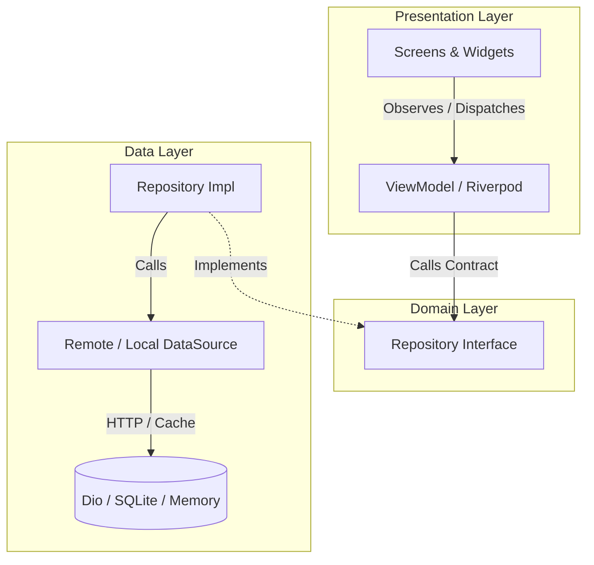

# 🏛 Flutter Boilerplate Architecture & Project Structure Guide

This document outlines the architectural principles, design patterns, and directory conventions established for this **Flutter Starter Boilerplate** project.

---

## 🎯 High-Level Philosophy

The boilerplate is built upon three foundational engineering principles:

1. **Feature-First Modularity:** Code is grouped primarily by business capabilities (e.g., `chat`, `profile`, `settings`) rather than technical stereotypes.
2. **Clean Layered MVVM (Model-View-ViewModel):** Strict boundary isolation between UI rendering, business domain logic, and data storage.
3. **Dependency Inversion Principle (DIP):** High-level business contracts (`domain`) remain decoupled from low-level implementations (`data` / network libraries / UI frameworks).

---

## 📁 Directory Structure Breakdown

```
lib/
├── app.dart                     # App entry widget & router configuration
├── main.dart                    # Application bootstrap & dependency setup
├── core/                        # Shared infrastructure & cross-cutting utilities
│   ├── constants/               # API endpoints and application constants
│   ├── errors/                  # Custom exceptions and failures hierarchy
│   ├── logging/                 # Structured logging using the logger package
│   ├── network/                 # Dio client, interceptors, and Result<T> sealed types
│   ├── router/                  # Type-safe GoRouter setup (go_router_builder)
│   └── theme/                   # Material 3 tokens, colors, and ThemeProvider
└── features/                    # Independent feature modules
    ├── chat/
    │   ├── data/                # Data sources, serialization models, repo implementations
    │   ├── domain/              # Pure business contracts & abstract repository interfaces
    │   └── presentation/        # Screens, ViewModels, and reusable UI components
    ├── profile/
    │   ├── data/
    │   ├── domain/
    │   └── presentation/
    └── settings/
        └── presentation/
```

---

## 🏗 Why Feature-First Instead of Layer-First?

In traditional **Layer-First** architecture, files are separated by technical responsibility at the root level:

```
# Layer-First (Discouraged for scaling applications)
lib/
├── models/
├── views/
├── controllers/
└── repositories/
```

This boilerplate adopts a **Feature-First** architecture to optimize for team velocity and modularity:

| Advantage | Practical Value |
| :--- | :--- |
| **High Cohesion** | All code related to a specific domain (models, business logic, UI) is co-located in a single directory. |
| **Scalability** | New features (e.g., audio calls, media feeds) can be added as isolated modules without touching existing domains. |
| **Safe Refactoring & Deprecation** | Features can be added, updated, or removed with zero impact on unrelated code. |
| **Concurrent Team Development** | Reduces git merge conflicts when multiple engineers work on separate features concurrently. |

---

## 🧱 The Anatomy of a Feature: Domain, Data, & Presentation

Every feature module follows a clean 3-tier layering model:



### 1. `domain/` (Business Rules & Contracts)
* **Contents:** Pure abstract repository contracts (e.g., `lib/features/chat/domain/repositories/chat_repository.dart`).
* **Invariants:** Must **not** import third-party transport packages (such as `Dio`), databases, or Flutter UI widgets.
* **Purpose:** Acts as the stable contract for what operations the domain supports, independent of whether data comes from REST, GraphQL, WebSockets, or a local database.

### 2. `data/` (Implementation Details & Transport)
* **Contents:**
  * Concrete repository implementations (e.g., `lib/features/chat/data/repositories/chat_repository_impl.dart`).
  * Data sources (e.g., `lib/features/chat/data/datasources/chat_remote_data_source.dart`).
  * Immutable Freezed data models with JSON serialization (e.g., `lib/features/chat/data/models/chat_message.dart`).
* **Data Source Co-location:**
  * Unlike the Repository interface (which bridges `domain` and `data`), Data Sources are internal implementation details of the `data` layer.
  * Defining the abstract interface and implementation within `chat_remote_data_source.dart` provides testability (mocking) without introducing unnecessary directory bloat.

### 3. `presentation/` (UI & State)
* **Contents:**
  * **Views:** Screen widgets responsible for page layout and routing.
  * **ViewModels:** Riverpod `Notifier` / `AsyncNotifier` instances managing reactive UI state.
  * **Widgets:** Reusable, `const`-optimized UI components.
  * **Local State:** `flutter_hooks` inside widgets for transient state (text controllers, focus nodes, animations) without polluting global state.

---

## 🧩 Headless Features & Shared Domain Services

A feature represents a **business capability**, not strictly a visual screen. It is entirely valid and common to have a feature that contains **no `presentation/` layer** and is consumed by multiple other features.

### 1. Decision Matrix: `features/` vs. `core/`

```
                               Is the capability tied to your app's
                                     specific business domain?
                                           /          \
                                         YES           NO
                                         /               \
                            Place in `features/`       Place in `core/`
                         (e.g., `features/notifications`)  (e.g., `core/connectivity`)
```

### 2. Headless Features in `features/<name>/`
When a service is specific to your application's domain or backend contracts, place it in `features/` even if it has no UI:

* **`features/notifications/`**:
  * Manages push tokens, notification payloads, badge counters, and deep-link routing.
  * Consumed across `chat`, `profile`, and other domain modules.
  * Omit the `presentation/` directory entirely:
    ```
    features/notifications/
    ├── data/
    │   ├── datasources/notification_remote_data_source.dart
    │   └── repositories/notification_repository_impl.dart
    └── domain/
        └── repositories/notification_repository.dart
    ```
* **`features/sync_engine/`**: Background sync service coordinating delta synchronization between SQLite cache and cloud servers.
* **`features/e2e_encryption/`**: Key rotation, cryptographic session handshakes, and ratchet management for messaging.

### 3. Domain-Agnostic Services in `core/<name>/`
When a service is generic and completely reusable across unrelated apps, place it in `core/`:

* **`core/connectivity/`**: Network reachability monitor (Wi-Fi vs Cellular vs Offline).
* **`core/analytics/`**: Centralized event tracking wrapper (Firebase Analytics, Mixpanel, Segment).
* **`core/secure_storage/`**: OS Keychain / EncryptedSharedPreferences wrapper.

### 4. Cross-Feature Boundary Rules
To maintain high modularity and prevent tight coupling:
1. **Never Depend on Another Feature's `data/` Layer:** Feature `A` may only consume Feature `B`'s `domain/` contract or exposed Riverpod provider.
2. **Prevent Circular Dependencies:** If Feature `A` and Feature `B` need each other's data, extract the shared concept into a dedicated domain service or coordinate via an application-level state notifier.

---

## 🌐 The Role of `core/`

The `core/` package houses shared, domain-agnostic infrastructure:

1. **`core/network/`**:
   * Centralized `Dio` client with configured timeouts, `LoggingInterceptor`, and `ErrorInterceptor`.
   * Sealed `Result<T>` type (`Success` vs `Failure`) for type-safe outcome handling with Dart 3 pattern matching.
2. **`core/errors/`**:
   * Domain-level `AppFailure` definitions and data-level `AppException` error hierarchy.
3. **`core/logging/`**:
   * Unified `AppLogger` utility wrapping the `logger` package to standardize debug, info, and error tracking across the codebase.
4. **`core/router/`**:
   * Type-safe route definitions (`app_routes.dart`) powered by `go_router` and `go_router_builder`.
5. **`core/theme/`**:
   * Centralized color tokens (`AppColors`), typography, and Light/Dark `ThemeData` definitions.

---

## ⚡️ Performance & Impeller Optimization Guidelines

1. **`const` Constructors:** Maximizes element reuse and skips unneeded widget rebuilds.
2. **`RepaintBoundary` on Dynamic Subtrees:** Isolates actively animating or frequently updated widgets (e.g. chat bubbles) to prevent full-screen canvas redraws.
3. **`ListView.builder` / Reverse Lists:** Lazy viewport rendering to ensure consistent 60/120 FPS frame rates on Android and iOS.
4. **Localized Hooks:** Using `flutter_hooks` for text input and transient focus state prevents rebuilding entire parent screen trees.
